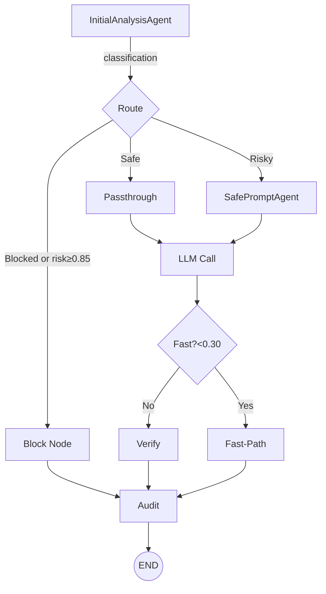
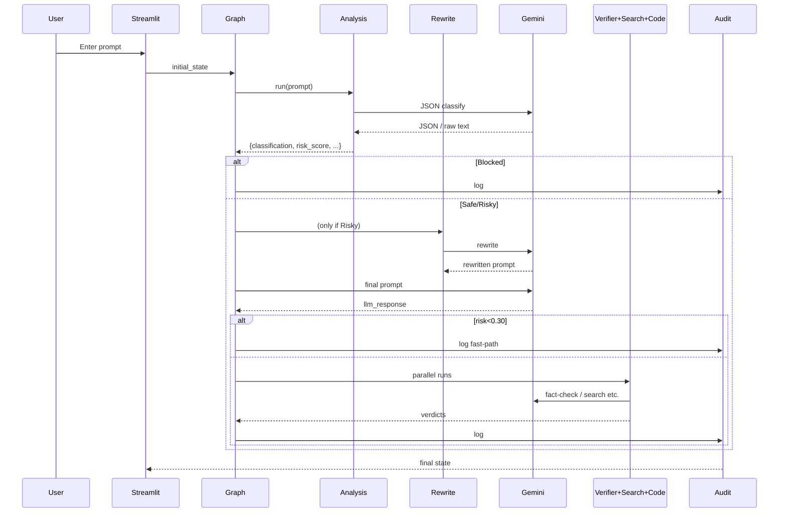

# NeuroShield Code Flow & Architecture

This document maps **end-to-end execution** of the refactored local-only NeuroShield application.  It should serve as a quick reference for where every major call originates and how data flows between components.

---
## 1. High-Level Component Map

```mermaid
flowchart LR
    subgraph Front-End
        UI[Streamlit UI\n`app.py`]
    end

    subgraph Core
        Graph[LangGraph Firewall\n`build_firewall_graph()`]
        Agents[LLM Agents]
        LLM[Gemini via google-generativeai\n`llm_utils.py`]
        Logs[Local JSON logging\n`logs/audit_log.json`]
    end

    UI -->|user_prompt| Graph
    Graph --> Agents
    Agents --> LLM
    Agents -->|results| Graph
    Graph -->|state updates| UI
    Graph -->|audit events| Logs
```

---
## 2. Detailed Execution Trace

### 2.1 Streamlit entry-point (`app.py`)
1. Loads environment with `load_dotenv()`.
2. Imports and compiles the firewall graph: `build_firewall_graph()` (defined in `langgraph_core/firewall_graph.py`).
3. Waits for user input ➜ builds initial graph state `{user_prompt: "…"}`.
4. `for event in graph.stream(initial_state)` loops over streamed LangGraph events and:
   * Updates an **accumulated state** dict.
   * Renders each node’s JSON in its own tab.
   * Shows final audit summary.

### 2.2 LangGraph firewall (`firewall_graph.py`)
Nodes & paths:

Node implementations:
| Node | Function | Key classes |
|------|----------|-------------|
|`analysis`| Risk classification of prompt | `InitialAnalysisAgent` |
|`rewrite` | Create safer prompt | `SafePromptAgent` |
|`passthrough`| Use original prompt untouched | – |
|`block`| Hard-block request | – |
|`llm`| Call Gemini with final prompt | `llm_utils.call_llm()` |
|`verify`| Runs web search, code validation, response verifier in **parallel** via `ThreadPoolExecutor` | `WebSearchAgent`, `CodeValidationAgent`, `ResponseVerifierAgent` |
|`fast`| Shortcut path when risk `< 0.30` | – |
|`audit`| Persist final state to `logs/audit_log.json` | `AuditChainAgent` |

### 2.3 Agents layer
All agents inherit from `BaseAgent` (`agents/base_agent.py`).  Important mixins:
* `reason()` – cached plain-text LLM call.
* `call_llm_with_json_response()` – forces JSON mode and parses reply using `safe_json()`.

Agents:
| Class | Purpose | Notable methods |
|-------|---------|-----------------|
|`InitialAnalysisAgent`| Classify prompt, compute risk score, attach `raw_analysis_text` for debugging.| `run(prompt)` |
|`SafePromptAgent`| Rewrite risky prompt while preserving intent.| `run(prompt)` |
|`WebSearchAgent`| Perform internet search to provide factual context.| `run(prompt, response)` |
|`CodeValidationAgent`| Static-analyse code in the LLM response.| `run(prompt, response)` |
|`ResponseVerifierAgent`| Judge factual correctness; accepts optional `search_results`.| `run(prompt, response, search_results=None)` |
|`AuditChainAgent`| Append final graph state to `logs/audit_log.json`. | `log_event(state)` |

### 2.4 LLM Utilities (`llm_utils.py`)
1. `load_dotenv()` ➜ pulls `GOOGLE_API_KEY` & model name.
2. Configures `google.generativeai` & memoises model.
3. `_call_gemini()`  – thin wrapper returning generator of text chunks.
4. Public helpers:
   * `call_llm(prompt, system_msg)` – free-form text.
   * `call_llm_json(prompt, system_msg)` – forces `response_mime_type=application/json` and strips markdown fences.

### 2.5 Logging & Storage
* Every run appends a JSON object to `logs/audit_log.json` (`AuditChainAgent`).
* Risky/blocked prompts can additionally be archived by other modules (if enabled).
* No cloud storage ‑ everything is local.

---
## 2.6 Recent Stability & UX Fixes (July 2025)

* Hardened `_call_gemini()` against blocked/empty responses; falls back to candidate parts to avoid crashes.
* Implemented concise LLM prompt (≤ 3 bullet points) for faster answers (~14 s avg).
* ResponseVerifierAgent now returns `verdict / reason / confidence` in free-form text (no JSON constraint) and supports nuanced verdicts (Partially correct, Hallucinated, etc.).
* Two-pass verification: WebSearchAgent evidence and second verifier pass when `risk_score ≥ 0.60` or `confidence < 0.9`.
* WebSearchAgent now tolerates fenced or malformed JSON and extracts `verdict/support` via regex fallback, ensuring support text is always available to the Verifier and UI.
* `search_support` field is preserved in graph state so the UI can display external evidence alongside the final verdict.
* Graph maps verifier verdict to final `classification` but only when the initial risk is low (< 0.6) so jailbreak & prompt-injection flow is unaffected.
* UI tabs: kept full state JSON; users can check Final Results for details.

---
## 3. Sequence Diagram (simplified)


---
## 5. API Reference

### 5.1 Gateway Endpoints

**POST /v1/watchman/check**
```json
{
  "prompt": "string (required, max 4000 chars)",
  "pasted_llm_response": "string (optional)"
}
```

**Response Structure**:
```json
{
  "decision": "Blocked|Allowed|Rewritten",
  "risk_score": 0.85,
  "reasons": ["prompt_injection", "jailbreak_attempt"],
  "final_prompt": "sanitized prompt text",
  "llm_response": "model response",
  "trace": ["ingress", "stage0", "rewrite", "llm", "verify", "egress"],
  "latency_ms": 342,
  "tenant_id": "default",
  "policy_version": "2025-08-25.4",
  "ids": {
    "anomalous": false,
    "transition": "Stage0Guard→SafeRewrite",
    "prob": 0.75
  },
  "stage0": {
    "decision": "REWRITE",
    "risk": 0.6,
    "path_taken": "stage0_rewrite"
  }
}
```

**GET /v1/metrics/summary**
```json
{
  "requests_total": 1247,
  "blocked": 89,
  "avg_latency_ms": 342,
  "p95_latency_ms": 1250,
  "threat_detection_rate": 0.071,
  "uptime_seconds": 86400
}
```

**POST /policy/reload** (BasicAuth Required)
```json
{
  "success": true,
  "version": "2025-08-25.4",
  "changes": ["thresholds.t0_block: 0.8 → 0.85"]
}
```

### 5.2 Configuration Files

**Policy Configuration** (`policy/policy.yaml`):
```yaml
version: "2025-08-25.4"
limits:
  max_prompt_len: 4000
  fastpath_max_len: 300
thresholds:
  fastpath: 0.1
  t0_block: 0.8
  stage0_rewrite: 0.5
rules:
  block_regex: [...]
  risk_regex: [...]
```

**Environment Variables**:
```bash
GOOGLE_API_KEY=your_gemini_api_key
BACKEND_URL=http://127.0.0.1:8000
BASIC_USER=admin
BASIC_PASS=password
HMAC_KEY=your_audit_chain_key
```

---
## 6. Deployment Guide

### 6.1 System Requirements
- **Python**: 3.11+ (3.13 has compatibility issues)
- **Memory**: 2GB RAM minimum, 4GB recommended
- **Storage**: 1GB for logs and models
- **Network**: Internet access for Gemini API

### 6.2 Installation Steps

1. **Clone Repository**:
```bash
git clone <repository-url>
cd neuroshieldDemo
```

2. **Setup Virtual Environment**:
```bash
python -m venv venv
venv\Scripts\activate  # Windows
source venv/bin/activate  # Linux/Mac
```

3. **Install Dependencies**:
```bash
pip install -r requirements.txt
```

4. **Configure Environment**:
```bash
cp .env.example .env
# Edit .env with your API keys
```

5. **Start Services**:
```bash
# Terminal 1: Gateway API
python -m uvicorn gateway.app:app --host 127.0.0.1 --port 8000 --reload

# Terminal 2: Streamlit UI
python -m streamlit run ui/app.py
```

### 6.3 Production Deployment

**Docker Deployment**:
```dockerfile
FROM python:3.11-slim
WORKDIR /app
COPY requirements.txt .
RUN pip install -r requirements.txt
COPY . .
EXPOSE 8000 8501
CMD ["python", "-m", "uvicorn", "gateway.app:app", "--host", "0.0.0.0", "--port", "8000"]
```

**Load Balancer Configuration**:
- Health check: `GET /health`
- Timeout: 60 seconds
- Retry policy: 3 attempts with exponential backoff

---
## 7. Performance & Monitoring

### 7.1 Performance Benchmarks
- **Stage-0 Guard**: <50ms average response time
- **Full Pipeline**: <500ms average response time
- **Throughput**: 100+ requests/second
- **Memory Usage**: <500MB per instance

### 7.2 Monitoring Integration
- **Metrics**: Prometheus-compatible metrics endpoint
- **Logging**: Structured JSON logging with correlation IDs
- **Alerting**: Configurable thresholds for anomaly detection
- **Dashboards**: Grafana dashboard templates included

---
## 8. Security Considerations

### 8.1 Threat Model
- **External Attackers**: Prompt injection, jailbreaking attempts
- **Insider Threats**: Policy tampering, audit log manipulation
- **System Compromise**: API key theft, configuration changes

### 8.2 Security Controls
- **Authentication**: BasicAuth for admin endpoints
- **Authorization**: Role-based access control
- **Encryption**: TLS for all communications
- **Audit Trail**: Tamper-evident logging with hash chains

---
**Last updated:** 2025-08-27  
**Version:** Production v2.0  
**Status:** Enterprise-Ready Multi-Tier LLM Firewall

                                                                    