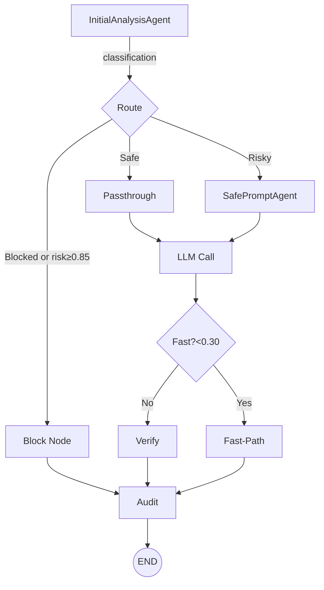
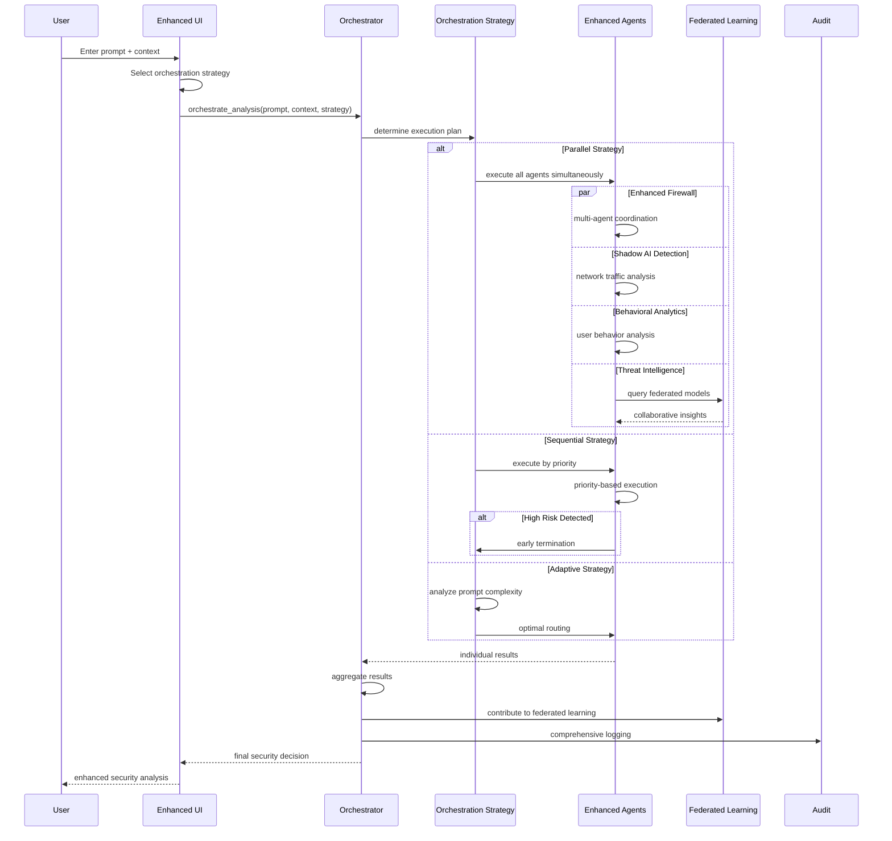

# NeuroShield Enhanced Architecture - Day 5 & Day 7 Integration

This document maps **end-to-end execution** of the enhanced NeuroShield application with Day 5 Agent Orchestration and Day 7 Federated Learning capabilities. It serves as a comprehensive reference for the new multi-agent architecture and federated intelligence system.

---
## 1. Enhanced Component Architecture

```mermaid
flowchart TB
    subgraph "Enhanced UI Layer"
        UI[Enhanced Streamlit UI\n`app_enhanced.py`]
        Config[Orchestration Config]
    end

    subgraph "Day 5: Agent Orchestration Layer"
        Orchestrator[Enhanced Agent Orchestrator\n`orchestrator_enhanced.py`]
        Strategy[Orchestration Strategies\nParallel/Sequential/Adaptive]
    end

    subgraph "Enhanced Agent Ecosystem"
        EFA[Enhanced Firewall Agent]
        SAA[Shadow AI Agent]
        BAA[Behavioral Analytics Agent]
        TIA[Threat Intelligence Agent]
        ADA[Attack Detection Agent]
        ACA[Audit Chain Agent]
    end

    subgraph "Day 7: Federated Learning"
        FLE[Federated Learning Engine\n`federated_learning_engine.py`]
        GlobalModel[Global Threat Models]
        PrivacyLayer[Differential Privacy]
    end

    subgraph "Original Core (Fallback)"
        Graph[LangGraph Firewall\n`build_firewall_graph()`]
        LLM[Gemini API\n`llm_utils.py`]
    end

    subgraph "Storage & Logging"
        Logs[Audit Logs\n`logs/audit_log.json`]
        Models[Federated Models\n`federated_models/`]
    end

    UI --> Config
    Config --> Orchestrator
    Orchestrator --> Strategy
    Strategy --> EFA
    Strategy --> SAA
    Strategy --> BAA
    Strategy --> TIA
    Strategy --> ADA
    Strategy --> ACA
    
    EFA --> FLE
    SAA --> FLE
    BAA --> FLE
    
    FLE --> GlobalModel
    FLE --> PrivacyLayer
    
    Orchestrator -.->|Fallback| Graph
    Graph --> LLM
    
    ACA --> Logs
    FLE --> Models
```

---
## 2. Detailed Execution Trace

### 2.1 Streamlit entry-point (`app.py`)
1. Loads environment with `load_dotenv()`.
2. Imports and compiles the firewall graph: `build_firewall_graph()` (defined in `langgraph_core/firewall_graph.py`).
3. Waits for user input ➜ builds initial graph state `{user_prompt: "…"}`.
4. `for event in graph.stream(initial_state)` loops over streamed LangGraph events and:
   * Updates an **accumulated state** dict.
   * Renders each node’s JSON in its own tab.
   * Shows final audit summary.

### 2.2 LangGraph firewall (`firewall_graph.py`)
Nodes & paths:

Node implementations:
| Node | Function | Key classes |
|------|----------|-------------|
|`analysis`| Risk classification of prompt | `InitialAnalysisAgent` |
|`rewrite` | Create safer prompt | `SafePromptAgent` |
|`passthrough`| Use original prompt untouched | – |
|`block`| Hard-block request | – |
|`llm`| Call Gemini with final prompt | `llm_utils.call_llm()` |
|`verify`| Runs web search, code validation, response verifier in **parallel** via `ThreadPoolExecutor` | `WebSearchAgent`, `CodeValidationAgent`, `ResponseVerifierAgent` |
|`fast`| Shortcut path when risk `< 0.30` | – |
|`audit`| Persist final state to `logs/audit_log.json` | `AuditChainAgent` |

### 2.3 Agents layer
All agents inherit from `BaseAgent` (`agents/base_agent.py`).  Important mixins:
* `reason()` – cached plain-text LLM call.
* `call_llm_with_json_response()` – forces JSON mode and parses reply using `safe_json()`.

Agents:
| Class | Purpose | Notable methods |
|-------|---------|-----------------|
|`InitialAnalysisAgent`| Classify prompt, compute risk score, attach `raw_analysis_text` for debugging.| `run(prompt)` |
|`SafePromptAgent`| Rewrite risky prompt while preserving intent.| `run(prompt)` |
|`WebSearchAgent`| Perform internet search to provide factual context.| `run(prompt, response)` |
|`CodeValidationAgent`| Static-analyse code in the LLM response.| `run(prompt, response)` |
|`ResponseVerifierAgent`| Judge factual correctness; accepts optional `search_results`.| `run(prompt, response, search_results=None)` |
|`AuditChainAgent`| Append final graph state to `logs/audit_log.json`. | `log_event(state)` |

### 2.4 Day 7: Federated Learning Integration
**Collaborative Threat Intelligence:**
```python
class FederatedLearningEngine:
    def __init__(self, participant_id, role):
        self.participant_id = participant_id
        self.role = role  # COORDINATOR, PARTICIPANT, VALIDATOR
        self.differential_privacy_epsilon = 1.0
        self.byzantine_tolerance_threshold = 0.3
```

**Key Features:**
- **Privacy-Preserving**: Differential privacy protection for sensitive data
- **Secure Aggregation**: Byzantine fault-tolerant model aggregation
- **Model Types**: Threat detection, behavioral analysis, anomaly detection
- **Collaborative Intelligence**: Global threat models without data sharing

**Federated Workflow:**
1. **Session Creation**: Coordinator creates federated learning session
2. **Participant Joining**: Multiple organizations join threat intelligence sharing
3. **Local Training**: Each participant trains on private data
4. **Secure Aggregation**: Model updates aggregated with privacy protection
5. **Global Model**: Distributed threat intelligence model updated
6. **Prediction**: Enhanced threat detection using collaborative intelligence

### 2.5 Enhanced Storage & Monitoring
**Comprehensive Logging:**
- **Audit Logs**: `logs/audit_log.json` - All security events and decisions
- **Orchestration History**: Agent performance metrics and execution traces
- **Federated Models**: `federated_models/` - Collaborative threat intelligence models
- **Performance Metrics**: Real-time agent health and system statistics

**System Administration:**
- **Agent Status Dashboard**: Real-time monitoring of all security agents
- **Performance Analytics**: Response times, success rates, error tracking
- **Federated Learning Stats**: Session participation, model accuracy, privacy metrics
- **Health Checks**: Automated system health monitoring and alerting

---
## 2.6 Enhanced Capabilities (Day 5 & Day 7 Integration)

**Day 5 - Enhanced Agent Orchestration:**
* **Multi-Strategy Coordination**: Adaptive, parallel, sequential, and priority-based orchestration
* **Intelligent Routing**: Dynamic agent selection based on prompt complexity and risk indicators
* **Performance Optimization**: Agent health monitoring, load balancing, and failover mechanisms
* **Comprehensive Metrics**: Real-time performance tracking and system health monitoring

**Day 7 - Federated Learning Integration:**
* **Privacy-Preserving Collaboration**: Differential privacy protection for sensitive threat data
* **Byzantine Fault Tolerance**: Secure aggregation resistant to malicious participants
* **Global Threat Intelligence**: Collaborative models without exposing private data
* **Multi-Model Support**: Threat detection, behavioral analysis, and anomaly detection models

**Enhanced Security Features:**
* **Shadow AI Detection**: Real-time monitoring for unauthorized AI service usage
* **Behavioral Analytics**: Advanced user behavior anomaly detection
* **Threat Intelligence**: Enhanced pattern matching with federated insights
* **Comprehensive Auditing**: Full security event logging and compliance tracking

---
## 3. Enhanced Execution Flow


---
## 4. Enhanced Trigger Points
| Trigger | Code Location | Downstream Effect |
|---------|---------------|-------------------|
|Enhanced Analysis|`app_enhanced.py` (`st.button("Run Enhanced Analysis")`) | Initiates orchestrated multi-agent analysis |
|Orchestration Strategy|`orchestrator_enhanced.py` | Routes to parallel/sequential/adaptive execution |
|Agent Execution|`agents/*.py` (`async def execute()`) | Coordinated security analysis with context |
|Federated Learning|`federated_learning_engine.py` | Collaborative threat intelligence sharing |
|Result Aggregation|`orchestrator_enhanced.py` (`_aggregate_results()`) | Combines multi-agent results into final decision |
|System Monitoring|Admin tab in `app_enhanced.py` | Real-time agent health and performance tracking |
|Audit Logging|`AuditChainAgent.execute()` | Enhanced security event logging with full context |

---
## 5. How to View Mermaid diagrams
Paste the mermaid blocks into VS Code (extension: *Markdown Preview Mermaid Support*) or any online viewer like <https://mermaid.live/>.

---
## 6. Integration Benefits

**Enhanced Security Coverage:**
- **Multi-Agent Coordination**: Comprehensive threat detection across multiple vectors
- **Adaptive Intelligence**: Dynamic routing based on threat complexity and risk indicators
- **Collaborative Learning**: Global threat intelligence without compromising privacy
- **Real-Time Monitoring**: Continuous system health and performance optimization

**Performance Improvements:**
- **Intelligent Routing**: Optimal agent selection for faster analysis
- **Parallel Processing**: Simultaneous execution for maximum coverage
- **Caching & Optimization**: Reduced response times through intelligent caching
- **Fault Tolerance**: Automatic failover and retry mechanisms

**Enterprise Readiness:**
- **Comprehensive Auditing**: Full security event logging and compliance tracking
- **System Administration**: Real-time monitoring and management capabilities
- **Federated Deployment**: Multi-organization threat intelligence sharing
- **Privacy Protection**: Differential privacy for sensitive data collaboration

---
**Last updated:** 2025-08-29 (Day 5 & Day 7 Integration)


                                                                    