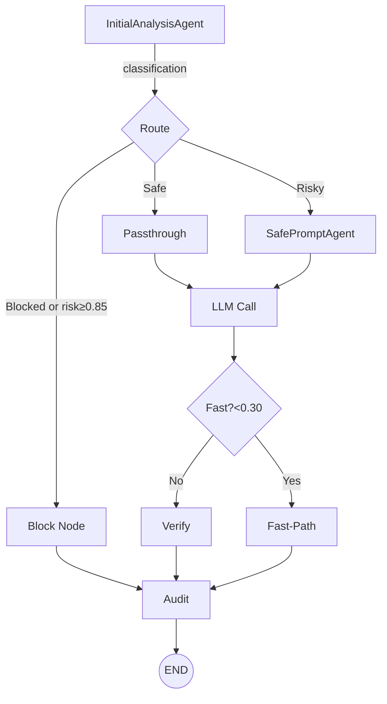
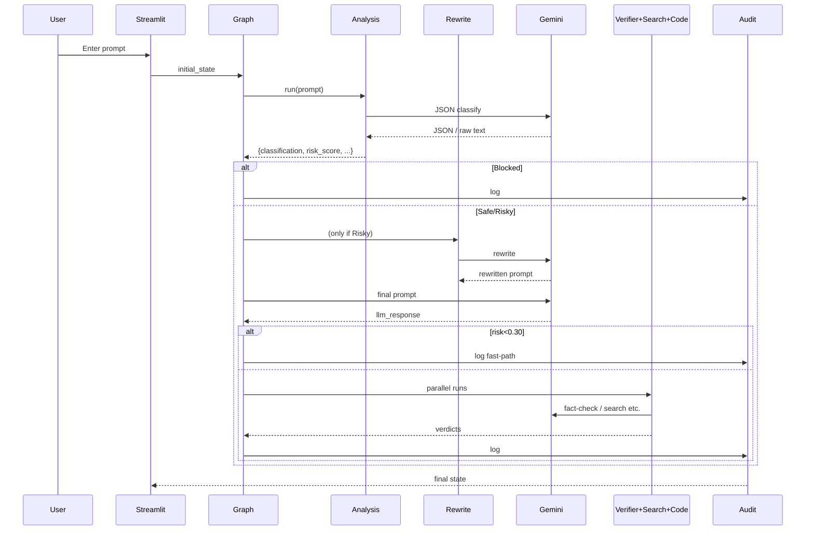
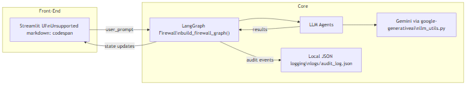
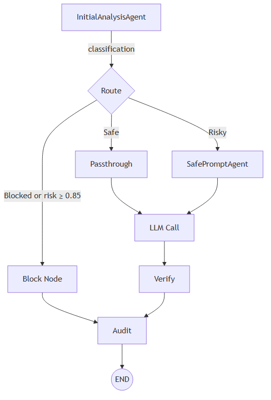

# NeuroShield Code Flow & Architecture

This document maps **end-to-end execution** of the refactored local-only NeuroShield application.  It should serve as a quick reference for where every major call originates and how data flows between components.

---
## 1. High-Level Component Map

```mermaid
flowchart LR
    subgraph Front-End
        UI[Streamlit UI\n`app.py`]
    end

    subgraph Core
        Graph[LangGraph Firewall\n`build_firewall_graph()`]
        Agents[LLM Agents]
        LLM[Gemini via google-generativeai\n`llm_utils.py`]
        Logs[Local JSON logging\n`logs/audit_log.json`]
    end

    UI -->|user_prompt| Graph
    Graph --> Agents
    Agents --> LLM
    Agents -->|results| Graph
    Graph -->|state updates| UI
    Graph -->|audit events| Logs
```

---
## 2. Detailed Execution Trace

### 2.1 Streamlit entry-point (`app.py`)
1. Loads environment with `load_dotenv()`.
2. Imports and compiles the firewall graph: `build_firewall_graph()` (defined in `langgraph_core/firewall_graph.py`).
3. Waits for user input ➜ builds initial graph state `{user_prompt: "…"}`.
4. `for event in graph.stream(initial_state)` loops over streamed LangGraph events and:
   * Updates an **accumulated state** dict.
   * Renders each node’s JSON in its own tab.
   * Shows final audit summary.

### 2.2 LangGraph firewall (`firewall_graph.py`)
Nodes & paths:

Node implementations:
| Node | Function | Key classes |
|------|----------|-------------|
|`analysis`| Risk classification of prompt | `InitialAnalysisAgent` |
|`rewrite` | Create safer prompt | `SafePromptAgent` |
|`passthrough`| Use original prompt untouched | – |
|`block`| Hard-block request | – |
|`llm`| Call Gemini with final prompt | `llm_utils.call_llm()` |
|`verify`| Runs web search, code validation, response verifier in **parallel** via `ThreadPoolExecutor` | `WebSearchAgent`, `CodeValidationAgent`, `ResponseVerifierAgent` |
|`fast`| Shortcut path when risk `< 0.30` | – |
|`audit`| Persist final state to `logs/audit_log.json` | `AuditChainAgent` |

### 2.3 Agents layer
All agents inherit from `BaseAgent` (`agents/base_agent.py`).  Important mixins:
* `reason()` – cached plain-text LLM call.
* `call_llm_with_json_response()` – forces JSON mode and parses reply using `safe_json()`.

Agents:
| Class | Purpose | Notable methods |
|-------|---------|-----------------|
|`InitialAnalysisAgent`| Classify prompt, compute risk score, attach `raw_analysis_text` for debugging.| `run(prompt)` |
|`SafePromptAgent`| Rewrite risky prompt while preserving intent.| `run(prompt)` |
|`WebSearchAgent`| Perform internet search to provide factual context.| `run(prompt, response)` |
|`CodeValidationAgent`| Static-analyse code in the LLM response.| `run(prompt, response)` |
|`ResponseVerifierAgent`| Judge factual correctness; accepts optional `search_results`.| `run(prompt, response, search_results=None)` |
|`AuditChainAgent`| Append final graph state to `logs/audit_log.json`. | `log_event(state)` |

### 2.4 LLM Utilities (`llm_utils.py`)
1. `load_dotenv()` ➜ pulls `GOOGLE_API_KEY` & model name.
2. Configures `google.generativeai` & memoises model.
3. `_call_gemini()`  – thin wrapper returning generator of text chunks.
4. Public helpers:
   * `call_llm(prompt, system_msg)` – free-form text.
   * `call_llm_json(prompt, system_msg)` – forces `response_mime_type=application/json` and strips markdown fences.

### 2.5 Logging & Storage
* Every run appends a JSON object to `logs/audit_log.json` (`AuditChainAgent`).
* Risky/blocked prompts can additionally be archived by other modules (if enabled).
* No cloud storage ‑ everything is local.

---
## 2.6 Recent Stability & UX Fixes (July 2025)

* Hardened `_call_gemini()` against blocked/empty responses; falls back to candidate parts to avoid crashes.
* Implemented concise LLM prompt (≤ 3 bullet points) for faster answers (~14 s avg).
* ResponseVerifierAgent now returns `verdict / reason / confidence` in free-form text (no JSON constraint) and supports nuanced verdicts (Partially correct, Hallucinated, etc.).
* Two-pass verification: WebSearchAgent evidence and second verifier pass when `risk_score ≥ 0.60` or `confidence < 0.9`.
* WebSearchAgent now tolerates fenced or malformed JSON and extracts `verdict/support` via regex fallback, ensuring support text is always available to the Verifier and UI.
* `search_support` field is preserved in graph state so the UI can display external evidence alongside the final verdict.
* Graph maps verifier verdict to final `classification` but only when the initial risk is low (< 0.6) so jailbreak & prompt-injection flow is unaffected.
* UI tabs: kept full state JSON; users can check Final Results for details.

---
## 3. Sequence Diagram (simplified)


---
## 4. Trigger Points Summary
| Trigger | Code Location | Downstream effect |
|---------|---------------|-------------------|
|User submits prompt|`app.py` (`st.button("Analyse Security")`) | Builds initial state and starts `graph.stream()` |
|Each LangGraph event|Loop in `app.py` lines ~180-210 | Updates UI per node & stores state |
|Node execution|Functions `n_*` in `firewall_graph.py` | Call agent(s), update state |
|Every audit|`AuditChainAgent.log_event()` | Appends JSON line to `logs/audit_log.json` |

---
## 5. How to View Mermaid diagrams
Paste the mermaid blocks into VS Code (extension: *Markdown Preview Mermaid Support*) or any online viewer like <https://mermaid.live/>.

---
**Last updated:** 2025-07-18




                                                                    