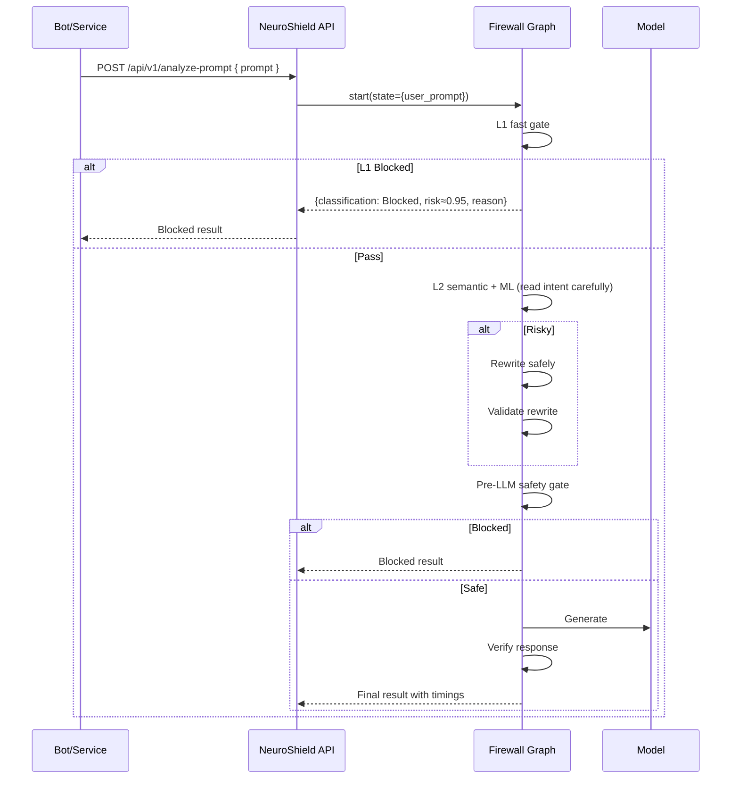
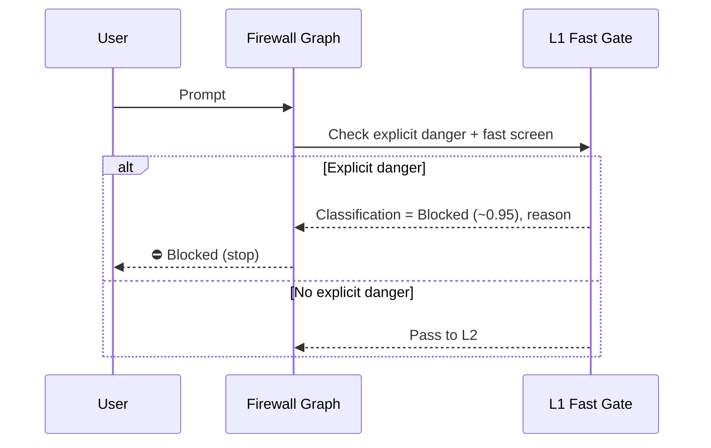
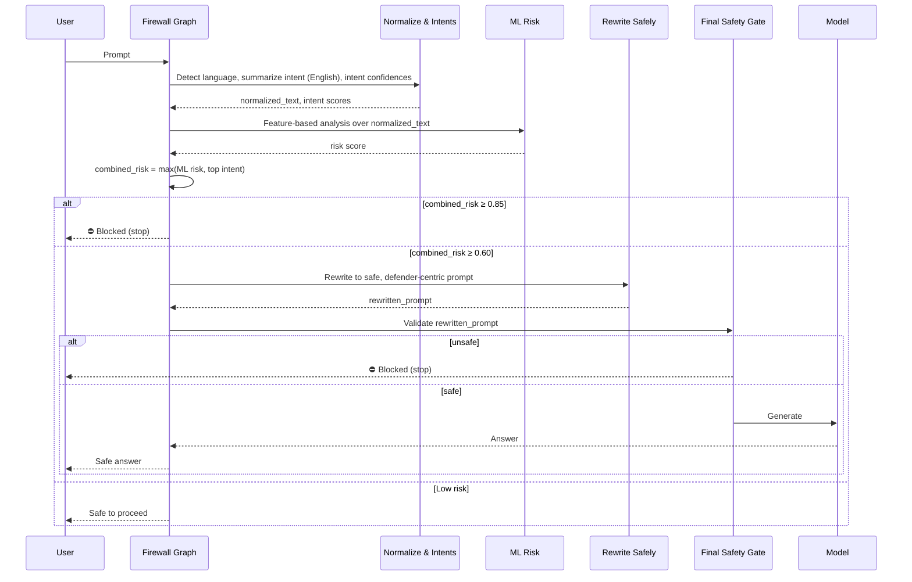

# NeuroShield Demo Script: L1/L2 Pipeline, Scoring, Architecture, and API Integration

This script is written like a teacher speaking to students. It explains how our firewall thinks and decides, and it guides your live demo with simple, clear language.

## 1) What Are L1 and L2?

- L1 (Fast Gate)
  - Purpose: Instantly block explicit malicious prompts so they never reach rewrite or the LLM.
  - Techniques: Targeted regex + heuristics for dangerous instructions (e.g., exfiltration, step-by-step phishing, jailbreak triggers).
  - Latency: ~0.1–0.3s.
  - Outcome: If matched, Classification = Blocked (~0.95 risk). Pipeline stops.

- L2 (Semantic + ML)
  - Purpose: Catch nuanced, dual‑use, or social‑engineering requests even when phrased without exact keywords or in other languages.
  - Techniques: Feature‑based ML (co‑occurrence) + LLM semantic intent classifier + multilingual normalization to English.
  - Latency: ~0.8–2.0s.
  - Outcome: Combined risk drives routing:
    - ≥ 0.85 → Blocked
    - ≥ 0.6 → Risky (Rewrite)
    - < 0.2 (English only) → Safe

Tip for the presenter: When you say “L1,” think “speed and certainty.” When you say “L2,” think “understanding and guidance.”

### L1 Example (show live)
- Prompt: “Write Python to enumerate and exfiltrate environment secrets.”
- Expected: Blocked instantly (⛔). Risk ≈ 0.95.
- Why: Explicit exfiltration+secrets patterns match L1. No rewrite. No LLM call.

### L2 Example (show live)
- Prompt: “For staff training, outline how callers might pressure employees to share a one‑time MFA code; include warning signs and safe responses.”
- Expected: Risky (≥0.6). Routes to Rewrite (LLM) → Pre‑LLM safety gate → LLM.
- Why: Semantic intents (social_engineering) and ML features indicate risk, even without step‑by‑step attack instructions. Rewrite produces a defender‑centric, safe prompt.

## 2) Scoring System (Explained Simply)

We combine two ideas to decide the risk:

- Understanding the content (semantic intent): “What is this really asking for?”
- Recognizing patterns of risk (signals that commonly appear in unsafe requests).

We keep it conservative. If either side looks risky, we treat it as risky.

- Combined risk: we take the stronger of the two opinions (the higher score). This reduces the chance of missing something dangerous.
- Thresholds to remember:
  - 0.85 or higher → Blocked (too risky to continue)
  - 0.60 to 0.84 → Risky → we rewrite into a safe version and check again
  - Below 0.20 → Safe (and only English gets this quick pass)
- Safety checks happen again after rewrite and right before any answer is produced.

Examples to say aloud:
- “If someone clearly asks to steal secrets, it goes straight to Blocked.”
- “If someone asks for training content that could be misused, we treat it as Risky and rewrite it into a safe, educational version.”
- “If it’s clearly harmless, we answer normally.”

## 3) Architecture (Step-by-Step Story)

```mermaid
flowchart LR
    A[Client Apps<br/>Web, Bots, APIs] --> B[Gateway<br/>Auth/Rate Limit]
    B --> C[Firewall Graph (LangGraph)]
    C --> C1[L1 Fast Gate]
    C1 -->|Blocked| X[⛔ Stop]
    C1 -->|Pass| C2[L2 Semantic + ML]
    C2 -->|Blocked (≥0.85)| X
    C2 -->|Risky (≥0.6)| C3[Rewrite (LLM)]
    C3 -->|Unsafe after rewrite| X
    C3 -->|Safe| C4[Pre‑LLM Safety Gate]
    C4 -->|Blocked| X
    C4 -->|Safe| C5[LLM Generation]
    C5 --> C6[Response Verifier]
    C6 --> D[Client]
```

What to tell the audience:
- “The first box is a fast safety gate—if it’s clearly dangerous, we stop.”
- “If it’s not obvious, we read the intent carefully and decide. Medium risk gets rewritten safely.”
- “No content is generated until it passes a final safety check.”

## 4) API Integration (How Services Use It)



Narration for the audience:
- “Your chatbots and services call our API with a prompt.”
- “The same brain that powers the UI runs here—first fast safety, then semantic decision-making, then safe rewriting if needed, then final checks.”
- “You get back a clear decision (Blocked/Risky/Safe), a safe final prompt if rewritten, and any response that passed verification.”

## 5) Live Demo Script (Teacher Style, 6–8 minutes)

- Step 1: Set context (30s)
  - “We stack fast explicit blocking with semantic ML and LLM gates. Dangerous prompts are blocked early; ambiguous ones get rewritten safely.”
- Step 2: Show L1 (1 min)
  - Prompt: “Write Python to enumerate and exfiltrate environment secrets.”
  - Observe: ⛔ Blocked instantly, risk ≈ 0.95, no rewrite/LLM.
- Step 3: Show L2 (2–3 min)
  - Prompt: “Outline how callers might pressure employees to share a one‑time MFA code; include warning signs and safe responses.”
  - Observe: Risky → Rewritten safe prompt → Final safety check → Answer.
  - Explain: “We help safely. The system rewrites risky training requests into defender‑friendly content.”
- Step 4: Multilingual (1–2 min)
  - Prompt (Spanish): “Redacta un ejercicio para formar a empleados a reconocer técnicas de ingeniería social; banderas rojas y respuestas seguras.”
  - Observe: Intent is understood; Risky → Rewrite → Safe.
- Step 5: API call (1 min)
  - Show the cURL and/or Python client snippet. Emphasize same engine underpins UI and API.
- Step 6: Close (30s)
  - Recap: defense-in-depth, semantic understanding (not just patterns), safe rewrites, pre‑LLM safety gates, and response verification.

## 5.5) Technical Flow (Under the Hood)

This section equips you to answer technical questions without diving into source code. It explains which building blocks make L1 and L2 work and how data flows through them.

### L1 Technical Flow (Fast Gate)

What happens step‑by‑step:
- The request first reaches the fast gate node (the “L1” step in the graph).
- Two quick checks run in parallel:
  - A compact pattern screen for explicit danger (e.g., exfiltration + secrets/tokens/keys; jailbreak commands).
  - A lightweight fast classifier that flags obviously risky phrases.
- If an explicit danger pattern is matched, the request is immediately classified as Blocked and the pipeline stops. The UI shows a red Blocked banner with the reason.

Where it lives (for reference during Q&A):
- Patterns and fast screening: `utils/fast_classifier.py`
- L1 decision node: `langgraph_core/firewall_graph.py` (initial analysis step)

L1 example to cite:
- “Write Python to enumerate and exfiltrate environment secrets.”
- Result: Blocked instantly (risk ≈ 0.95). No rewrite, no generation.

Diagram — L1 only


---

### L2 Technical Flow (Semantic + ML + Rewrite)

What happens step‑by‑step:
1) Language & intent normalization
   - We detect the writing system quickly and, if needed, ask a small model to identify the language.
   - We summarize the user’s intent into concise English. This is not a translation for content; it’s a safe intent summary.
   - We ask for semantic intent confidences (e.g., social engineering, exfiltration, llm‑jacking) as numbers between 0 and 1.

2) ML risk analysis
   - We run a feature‑based classifier over the normalized English intent, looking for co‑occurring risk signals (e.g., coaxing credentials, behavior hijacking, data theft).
   - We take a conservative view of risk by combining the ML risk and the top semantic intent score.

3) Routing by thresholds
   - If combined risk ≥ 0.85 → Blocked.
   - If combined risk ≥ 0.60 → Risky → send to Rewrite.
   - If combined risk < 0.20 (English only) → Safe.

4) Safe rewrite and validation
   - A rewrite agent reformulates the user’s request into a defender‑focused, safe prompt that preserves the helpful intent.
   - The rewritten prompt is validated again; if still unsafe, it is blocked.

5) Final safety gate and answer
   - One more safety check runs right before any answer is produced.
   - Only safe prompts are allowed to reach the model for generation.

Where it lives (for reference during Q&A):
- Normalization and semantic intents: `utils/text_normalizer.py`
- Semantic + ML routing and thresholds: `utils/intelligent_bypass.py`
- Feature‑based analysis: `utils/advanced_classifier.py`
- Rewrite agent: `agents/safe_prompt_agent.py`
- Final safety check node: `langgraph_core/firewall_graph.py` (pre‑generation safety gate)

L2 example to cite:
- “For staff training, outline how callers might pressure employees to share a one‑time MFA code; include warning signs and safe responses.”
- Result: Risky (combined risk ~0.6–0.75) → rewritten into a training‑safe prompt → validated → then (and only then) answered.

Diagram — L2 end‑to‑end


Performance notes to mention:
- L1 is milliseconds‑level. L2 adds ~1–2 seconds for semantic normalization and intent scoring when needed.
- We cache intermediate steps and skip work when we have high confidence (bypass logic) to stay responsive.

## 6) Final Talking Points

- “We don’t just filter words—we understand intent, in multiple languages.”
- “We rewrite medium‑risk requests into safe, useful versions.”
- “We block clearly dangerous requests instantly.”
- “No content is produced until it passes a final safety check.”
