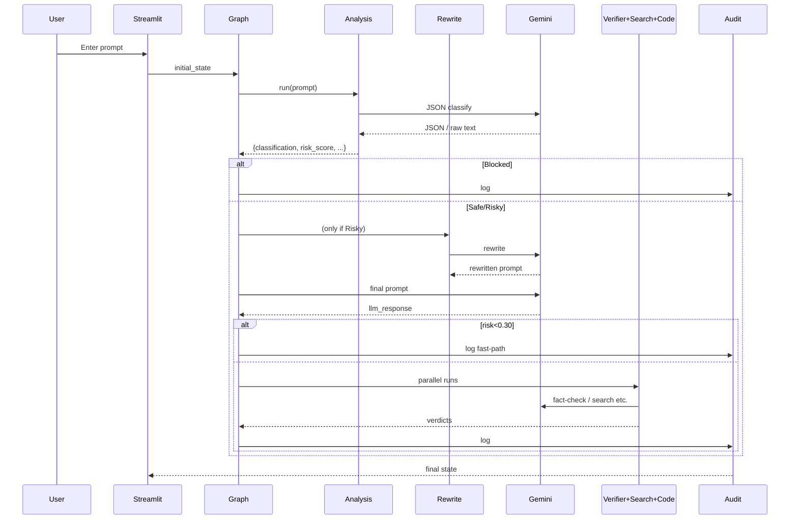

# NeuroShield Architecture & System Design

This document outlines the **current implementation** and **future roadmap** of the NeuroShield LLM security platform, providing a comprehensive view of the multi-layered security architecture.

---
## 1. Current System Architecture

```mermaid
flowchart TB
    subgraph "UI Layer"
        UI[Enhanced Streamlit UI\n`app_updated.py`]
        Config[Progressive Display\nReal-time State Updates]
    end

    subgraph "Security Analysis Layer"
        Graph[LangGraph Firewall\n`build_firewall_graph()`]
        L1[Layer 1: Fast Classifier\n<200ms Pattern Matching]
        L2[Layer 2: Intelligent Bypass\nAdvanced Heuristics]
        L3[Layer 3: LLM Deep Analysis\nGemini API Integration]
    end

    subgraph "Agent Ecosystem"
        IAA[Initial Analysis Agent\nRisk Classification]
        ADA[Attack Detection Agent\nThreat Pattern Recognition]
        SPA[Safe Prompt Agent\nPrompt Rewriting]
        RVA[Response Verifier Agent\nContent Validation]
        CVA[Code Validation Agent\nSecurity Scanning]
        WSA[Web Search Agent\nFact Verification]
        ACA[Audit Chain Agent\nCompliance Logging]
    end

    subgraph "Core Infrastructure"
        LLM[Gemini API\n`llm_utils.py`]
        FastC[Fast Classifier\nRegex Pattern Engine]
        IntBypass[Intelligent Bypass\nHeuristic Analysis]
    end

    subgraph "Storage & Logging"
        Logs[Audit Logs\n`logs/audit_log.json`]
        Cache[Response Cache\nPerformance Optimization]
    end

    UI --> Config
    Config --> Graph
    Graph --> L1
    L1 --> L2
    L2 --> L3
    
    L1 --> FastC
    L2 --> IntBypass
    L3 --> IAA
    
    IAA --> ADA
    IAA --> SPA
    SPA --> RVA
    RVA --> CVA
    CVA --> WSA
    WSA --> ACA
    
    L3 --> LLM
    FastC --> LLM
    IntBypass --> LLM
    
    ACA --> Logs
    RVA --> Cache
```

---
## 2. Multi-Layer Security Analysis

### 2.1 Layer 1: Fast Pattern Detection (⚡ <200ms)
- **Purpose**: Immediate classification of obvious threats and safe content
- **Technology**: Compiled regex patterns, keyword matching
- **Coverage**: 
  - Safe patterns: Educational queries, creative writing
  - Risky patterns: Social engineering, credential harvesting
  - Blocked patterns: System manipulation, jailbreak attempts
- **Performance**: 0.1-0.3 seconds, 95%+ accuracy for clear cases

### 2.2 Layer 2: Intelligent Bypass (🧠 1-3s)
- **Purpose**: Advanced heuristic analysis for ambiguous content
- **Technology**: Entropy analysis, semantic pattern recognition
- **Coverage**: Context-dependent risks, sophisticated social engineering
- **Performance**: 1-3 seconds, handles edge cases Layer 1 misses

### 2.3 Layer 3: LLM Deep Analysis (🤖 2-8s)
- **Purpose**: Complex reasoning for nuanced security decisions
- **Technology**: Google Gemini API with specialized security prompts
- **Coverage**: Ambiguous scenarios requiring human-like reasoning
- **Performance**: 2-8 seconds, highest accuracy for complex cases

---
## 3. Sequence Diagram (simplified)


---
## 4. Trigger Points Summary
| Trigger | Code Location | Downstream effect |
|---------|---------------|-------------------|
|User submits prompt|`app.py` (`st.button("Analyse Security")`) | Builds initial state and starts `graph.stream()` |
|Each LangGraph event|Loop in `app.py` lines ~180-210 | Updates UI per node & stores state |
|Node execution|Functions `n_*` in `firewall_graph.py` | Call agent(s), update state |
|Every audit|`AuditChainAgent.log_event()` | Appends JSON line to `logs/audit_log.json` |

---
## 5. How to View Mermaid diagrams
Paste the mermaid blocks into VS Code (extension: *Markdown Preview Mermaid Support*) or any online viewer like <https://mermaid.live/>.

---
**Last updated:** 2025-07-18


                                                                    